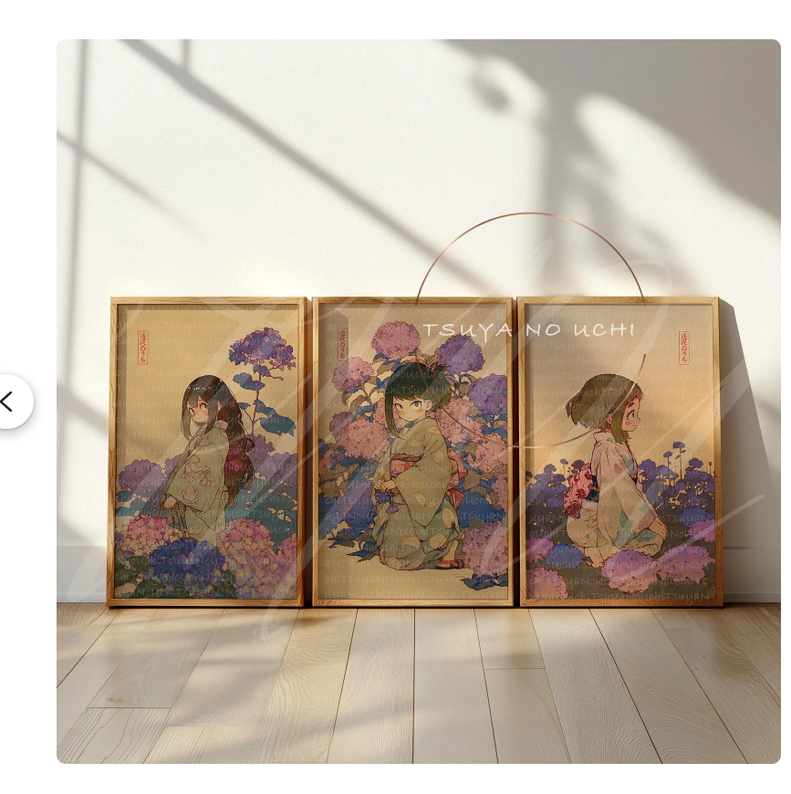

# TSUYA NO UCHI — Ukiyo‑e Style Anime Art Prints

A modern e-commerce website for ukiyo‑e inspired anime art prints. Built with Next.js 15, Sanity CMS, and Tailwind CSS v4.



## ✨ Features

- **🎨 Beautiful Ukiyo-e Aesthetic**: Soft palettes, paper textures, and timeless design
- **🛍️ E-commerce Functionality**: Browse, filter, and view products with detailed pages
- **📱 Fully Responsive**: Optimized for desktop, tablet, and mobile devices
- **🎯 Content Management**: Powered by Sanity CMS for easy product management
- **⚡ High Performance**: Built with Next.js 15 App Router and React 19
- **🎭 Modern UI Components**: shadcn/ui components with Tailwind CSS v4
- **🔍 SEO Optimized**: Proper metadata and OpenGraph tags for better discoverability

## 🚀 Tech Stack

- **Framework**: [Next.js 15](https://nextjs.org/) (App Router)
- **CMS**: [Sanity.io](https://www.sanity.io/)
- **UI Library**: [shadcn/ui](https://ui.shadcn.com/)
- **Styling**: [Tailwind CSS v4](https://tailwindcss.com/)
- **Language**: [TypeScript](https://www.typescriptlang.org/)
- **Font**: [Geist Sans & Mono](https://vercel.com/font)
- **Icons**: [Lucide React](https://lucide.dev/)
- **Package Manager**: [pnpm](https://pnpm.io/)

## 📋 Prerequisites

Before you begin, ensure you have the following installed:

- **Node.js** (v20 or higher)
- **pnpm** (v8 or higher) - Install with `npm install -g pnpm`
- **Git**

## 🛠️ Installation

### 1. Clone the Repository

```bash
git clone https://github.com/jenozu/tsuyanouchi.git
cd tsuyanouchi
```

### 2. Install Dependencies

```bash
pnpm install
```

### 3. Set Up Environment Variables

Create a `.env.local` file in the root directory:

```bash
# Sanity Configuration
# Get these values from https://www.sanity.io/manage
NEXT_PUBLIC_SANITY_PROJECT_ID=your_project_id_here
NEXT_PUBLIC_SANITY_DATASET=production

# Optional: For Sanity Studio authentication and live preview
# Create a token with Viewer permissions at https://www.sanity.io/manage
SANITY_API_READ_TOKEN=your_read_token_here
```

**Note**: The project includes fallback products, so it will work without Sanity configuration. However, to use the CMS features, you'll need to set up a Sanity project.

### 4. Set Up Sanity (Optional)

If you want to use Sanity CMS for content management:

1. **Create a Sanity Account**: Go to [sanity.io](https://www.sanity.io/) and sign up
2. **Create a New Project**: 
   - Go to [sanity.io/manage](https://www.sanity.io/manage)
   - Click "Create project"
   - Note your Project ID
3. **Update Environment Variables**: Add your Project ID to `.env.local`
4. **Access Sanity Studio**: Visit `http://localhost:3000/studio` after starting the dev server

### 5. Start the Development Server

```bash
pnpm dev
```

Open [http://localhost:3000](http://localhost:3000) in your browser to see the result.

## 📂 Project Structure

```
tsuyanouchi/
├── app/                      # Next.js App Router
│   ├── globals.css          # Global styles with Tailwind v4
│   ├── layout.tsx           # Root layout with metadata
│   ├── page.tsx             # Homepage
│   ├── shop/                # Shop pages
│   │   ├── page.tsx        # Shop listing
│   │   └── [slug]/         # Product detail pages
│   │       └── page.tsx
│   └── studio/             # Sanity Studio
│       └── [[...tool]]/
│           └── page.tsx
├── components/              # React components
│   ├── navbar.tsx          # Navigation bar
│   ├── footer.tsx          # Footer
│   ├── product-card.tsx    # Product card component
│   ├── shop/               # Shop-specific components
│   │   ├── filters.tsx
│   │   ├── product-detail.tsx
│   │   └── shop-grid.tsx
│   └── ui/                 # shadcn/ui components
│       ├── button.tsx
│       ├── card.tsx
│       └── ...
├── hooks/                   # Custom React hooks
│   ├── use-mobile.ts
│   └── use-toast.ts
├── lib/                     # Utility functions
│   ├── products.ts         # Product data & Sanity queries
│   └── utils.ts            # Helper utilities
├── public/                  # Static assets
│   ├── images/             # Product images
│   └── ...
├── sanity/                  # Sanity configuration
│   ├── lib/
│   │   ├── client.ts       # Sanity client setup
│   │   └── queries.ts      # GROQ queries
│   ├── schemaTypes/
│   │   ├── index.ts
│   │   └── product.ts      # Product schema
│   └── structure.ts        # Studio structure
├── sanity.config.ts         # Sanity Studio config
├── next.config.mjs          # Next.js configuration
├── package.json             # Dependencies
└── tsconfig.json            # TypeScript config
```

## 🎨 Key Features

### Homepage
- Hero section with featured artwork
- About section with brand story
- Featured products showcase

### Shop Page
- Product grid with filtering
- Filter by size (A5, A4, A3, 11x14)
- Filter by theme (blossom, portrait, nature, yokai)
- Responsive layout

### Product Detail Page
- Image gallery with thumbnails
- Size selector
- Quantity picker
- Add to cart functionality (demo)
- Related products recommendations

### Sanity Studio
- Product management
- Image uploads
- Tag and size management
- Live preview integration

## 🧪 Development Scripts

```bash
# Start development server
pnpm dev

# Build for production
pnpm build

# Start production server
pnpm start

# Run linter
pnpm lint
```

## 🎯 Sanity Schema

### Product Type

```typescript
{
  title: string           // Product title
  slug: slug             // URL-friendly identifier
  price: number          // Price in USD
  mainImage: image       // Primary product image
  gallery: image[]       // Additional images
  sizes: string[]        // Available sizes (A5, A4, A3, 11x14)
  tags: string[]         // Tags (blossom, portrait, nature, yokai)
  description: text      // Product description
  inStock: boolean       // Availability status
}
```

## 🚀 Deployment

### Deploy to Vercel

The easiest way to deploy this project is using [Vercel](https://vercel.com):

1. **Push to GitHub**: Ensure your code is in a GitHub repository
2. **Import to Vercel**: 
   - Go to [vercel.com](https://vercel.com)
   - Click "New Project"
   - Import your repository
3. **Configure Environment Variables**: Add your Sanity credentials
4. **Deploy**: Click "Deploy"

[](https://vercel.com/new/clone?repository-url=https://github.com/jenozu/tsuyanouchi)

### Environment Variables for Production

Make sure to set these in your Vercel project settings:

```
NEXT_PUBLIC_SANITY_PROJECT_ID=your_project_id
NEXT_PUBLIC_SANITY_DATASET=production
SANITY_API_READ_TOKEN=your_token (optional)
```

## 🎨 Customization

### Colors

The site uses a custom emerald color scheme. To change it, update the Tailwind classes in components:

```tsx
// Current: bg-emerald-900
// Change to: bg-your-color-900
```

### Products

To add or modify products:

1. **With Sanity**: Visit `/studio` and manage products in the CMS
2. **Without Sanity**: Edit `lib/products.ts` and update the `fallbackProducts` array

### Styling

Global styles are in `app/globals.css`. The project uses Tailwind CSS v4 with custom CSS variables for theming.

## 📝 Product Management

### Using Sanity Studio

1. Navigate to `http://localhost:3000/studio`
2. Sign in with your Sanity account
3. Click "Products" to manage your inventory
4. Add new products with:
   - Title
   - Slug (auto-generated)
   - Price
   - Images (main + gallery)
   - Sizes
   - Tags
   - Description

### Using Fallback Products

If you're not using Sanity, the site will automatically use the fallback products defined in `lib/products.ts`. You can modify these directly in the code.

## 🐛 Troubleshooting

### Common Issues

**Issue**: "Failed to fetch from Sanity"
- **Solution**: Check that your `NEXT_PUBLIC_SANITY_PROJECT_ID` is correct
- The site will fall back to demo products if Sanity is unavailable

**Issue**: Images not loading
- **Solution**: Ensure images are in the `public/` directory
- For Sanity images, check that the image URLs are accessible

**Issue**: TypeScript errors
- **Solution**: Run `pnpm install` to ensure all dependencies are installed
- Check `tsconfig.json` for correct configuration

## 📚 Learn More

- [Next.js Documentation](https://nextjs.org/docs)
- [Sanity Documentation](https://www.sanity.io/docs)
- [Tailwind CSS v4 Documentation](https://tailwindcss.com/docs)
- [shadcn/ui Documentation](https://ui.shadcn.com/)

## 📄 License

This project is for educational and portfolio purposes.

## 👤 Author

Created with care for the art of ukiyo-e and modern design.

---

**Note**: This is a demonstration project. Cart and checkout functionality are currently in demo mode. For a full e-commerce solution, consider integrating Stripe, PayPal, or similar payment processors.

